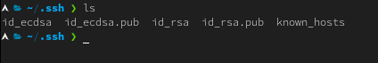
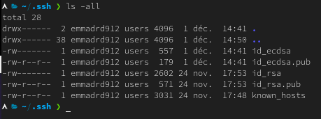
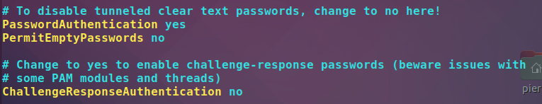
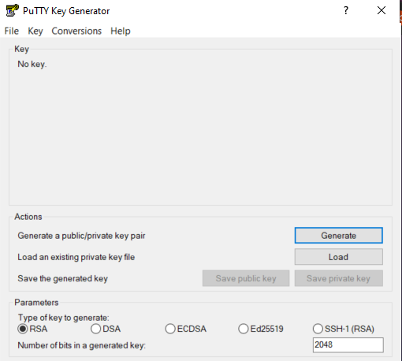
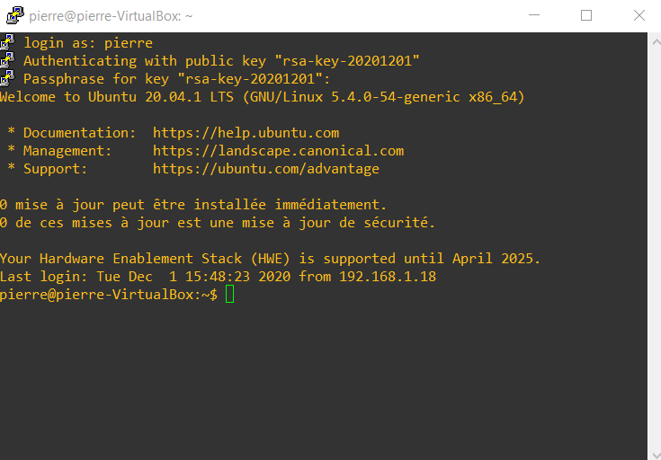

# TP2 : Chiffrement et authentification à l'aide du chiffrement asymétrique
## Sécurisation des sessions distantes avec openssh

## Classe : B3B
## Élèves : Emma Durand **[@emmadrd912](https://github.com/emmadrd912)** et Pierre Ceberio **[@PierreYnov](https://github.com/PierreYnov)** 

# Sommaire 

- [Le Lab](#le-lab)
- [Rappels théoriques](#rappels-th%C3%A9oriques)
- [Préparation du serveur](#pr%C3%A9paration-du-serveur)
    - [I. Première connexion](#i-premi%C3%A8re-connexion)
    - [II. Seconde connexion](#ii-seconde-connexion)
- [Préparation du client UNIX/BSD](#pr%C3%A9paration-du-client-unixbsd)
- [Préparation du client Windows](#pr%C3%A9paration-du-client-windows)

## Le Lab

Serveur Linux avec 2 clients :
- 1 Linux via le client ``SSH``
- 1 Windows via l'utilitaire [PuTTY](https://www.putty.org/)

## Rappels théoriques

**Rappelez le fonctionnement du chiffrement asymétrique**

La cryptographie asymétrique est un procédé qui intègre deux clés de chiffrement, une **clé publique** et une **clé privée**. La clé publique du destinataire est utilisée pour **chiffrer** et la clef privée du destinataire pour **déchiffrer** un message. Le même algorithme est utilisé pour les deux clefs.

**Comment est assurée l'authentification ?**

Puisqu’une clé privée unique a été utilisée pour la signature du message ou du document, son destinataire a la garantie que l'identité du signataire est légitime.

## Préparation du serveur 

### I. Première connexion 

    - démarrage de ma ubuntu
    - création compte 
    - éditez fichier /etc/ssh/sshd_config pour interdire connexion compte root

Passage de ``PermitRootLogin`` en ``no`` puis ``restart`` du service sshd

**Vérifier que seulement protocole SSHv2 est accepté** 

Ajout de la ligne ``Protocol 2``

**Consultez les recommandations de l'ANSSI, quelles mesures supplémentaires pourriez-vous
prendre pour renforcer la configuration de votre serveur OpenSSH ?**

- Il faut s’assurer de la légitimité du serveur contacté avant de poursuivre l’accès. Cela
passe par l’authentification préalable de la machine au travers de l’empreinte de sa clé
publique, ou d’un certificat valide et vérifié.

- Lorsque les clients et les serveurs SSH supportent ``ECDSA``, son usage doit être préféré à
``RSA``.
- L’usage de clés ``DSA`` n’est pas recommandé.
- Les clés doivent être générées dans un contexte où la source d’aléa est fiable, ou à défaut
dans un environnement où suffisamment d’entropie a été accumulée
- Quelques règles permettent de s’assurer que le réservoir d’entropie est correctement
rempli :

    • la machine de génération de clés doit être une machine physique 

    • elle doit disposer de plusieurs sources d’entropie indépendantes 

    • l’aléa ne doit être obtenu qu’après une période d’activité suffisamment importante
    (plusieurs minutes voire heures).
    
- La clé privée ne doit être connue que de l’entité qui cherche à prouver son identité à un
tiers et éventuellement d’une autorité de confiance. Cette clé privée doit être dûment
protégée pour en éviter la diffusion à une personne non autorisée.

- Avec ``OpenSSH``, ce contrôle se fait de plusieurs façons :

    • en s’assurant que l’empreinte de la clé présentée par le serveur est la bonne (obtenue
    préalablement avec ssh-keygen -l) 

    • en rajoutant la clé manuellement dans le fichier known_hosts 

    • en vérifiant la signature du certificat présenté par le serveur avec une autorité de
    certification (AC) reconnue par le client.

**Faites un ssh-keygen**

On copie-colle la clef.

### II. Seconde connexion 

On se connecte avec ``ssh pierre@192.168.1.24`` et répond ``no``

    The authenticity of host '192.168.1.24 (192.168.1.24)' can't be established.
    ECDSA key fingerprint is SHA256:NXOg+pjbszJxGpTKNS2iMqBph2GaJA1nzsQhpriEWXc.
    Are you sure you want to continue connecting (yes/no)? no
    Host key verification failed.

**Expliquez pourquoi le système vous pose cette question**

``OpenSSH`` adopte par défaut un modèle de sécurité *Trust On First Use (TOFU)* : lors de la première
connexion et à défaut de pouvoir authentifier l’hôte, ``ssh`` demande confirmation à l’utilisateur qu’il
s’agit bien de la bonne clé (via son empreinte). Si l’utilisateur confirme que l’empreinte est bonne, ssh
procèdera à son enregistrement dans le fichier ``known_hosts`` afin de permettre sa vérification lors des
visites suivantes.

**Vérifier le fingerprint**

Sur le serveur, pour obtenir le fingerprint : 

``ssh-keygen -lf /etc/ssh/ssh_host_ecdsa_key.pub``

On remarque que sur notre client, pendant la demande de connexion, on obtient le même fingerprint.

**Que va-t-il se passer si vous acceptez la clef publique ?**

Le fichier ``known_hosts`` se met à jour avec l'ajout de la clef afin de permettre sa vérification lors des prochaines visites.

Je vérifie en allant voir le fichier et je vois qu'une nouvelle ligne a été ajoutée : 

## Préparation du client UNIX/BSD 

    - on génère la biclef sur le client Linux avec une passphrase robuste : ssh-keygen

**Les recommandations de l'ANSSI pour l'algorithme & la longueur adéquate de la clef**

La taille de clé minimale doit être de **2048 bits** pour ``RSA``.

La taille de clé minimale doit être de **256 bits** pour ``ECDSA``.

    ssh-keygen -t rsa -b 2048 -f <fichier de clé RSA>
    ssh-keygen -t ecdsa -b 256 -f <fichier de clé ECDSA>

**Vérification des générations des clefs**

Nous avons choisi d'utiliser ``ECDSA`` pour la génération clé (privilégié par l'ANSSI). 
Une fois la clé générée, deux fichiers apparaissent : 
- id_ecdsa.pub 
- id_ecdsa

**Configurer les droits d'accès à la clef privée**

Une clé privée d’authentification utilisateur ne doit être lisible que par l’utilisateur auquel
elle est associée.

On vérifie avec ``ls -la``

On a également précédemment rajouté un mot de passe sur la clé.

**À quoi sert l'option ``StrictModes``**

L'option est dans le fichier ``sshd_config``. Elle permet de vérifier les droits sur le dossier ``./ssh/`` afin d'être sûr que son accès soit protégé.

**Mettre la clef publique du client sur le serveur dans ``authorized_keys``**

Sur le serveur on crée le fichier ``authorized_keys``, on lui met la clé publique du client et on lui met les bonnes permissions.

On passe en ``root`` (``sudo su``), on modifie le fichier ``vi /etc/ssh/sshd_config``

On dé-commente ces lignes pour autoriser les clés mises dans le fichier ``authorized_keys``

On redémarre le service ``SSH`` pour appliquer les modifications

``/etc/init.d/ssh restart``

Je vérifie en me connectant :

Ça marche ! 

## Préparation du client Windows 

**Configurer un client Windows à l'aide de [PuTTY](https://www.putty.org/)**

Je génère une nouvelle clé grâce à ``Putty Gen``.

Je copie-colle la clé publique générée et la mets sur le serveur.

Je sauvegarde la clé privée générée.

Je crée une nouvelle session, en précisant l'IP et le port 22.

Dans ``Connections > SSH > Auth`` , je place la clé privée précédemment sauvegardée.

Puis je clique sur ``Save`` puis ``Open``.

Je tape l'username sur lequel je veux me connecter (ici ``pierre``), puis la passphrase de la clé, et me voilà connecté :

    
